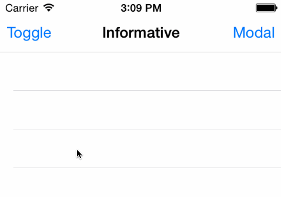

Informative
===========

iOS library for creating an information view positioned below the status bar, similar to the inbuilt iOS in-call status bar.

Compatible with iOS 6/7, iPhone & iPad.

* Appears on all UINavigationControllers automatically
* Supports tap handler
* Supports use of any UIView, `InformationView` provided (can be subclassed)
* No use of private APIs



### Installation

Add ```pod 'Informative'``` to your Podfile.

### Example Code

```objc
Informative *informative = [Informative singleton];

informative.tapInformationView = ^{
  [[[UIAlertView alloc] initWithTitle:@"Tapped Information View" message:@"Awesome!" delegate:nil cancelButtonTitle:@"Close" otherButtonTitles:nil] show];
};

informative.createInformationView = ^UIView*
{
  InformationView *notReachableView = [[InformationView alloc] init];
  notReachableView.text = @"No Internet Connection";
  return notReachableView;
};

// Inside reachability handler
[Informative singleton].showInformation = !reachable;
```

### License

This library is available under the [MIT license](http://www.opensource.org/licenses/mit-license.php).
